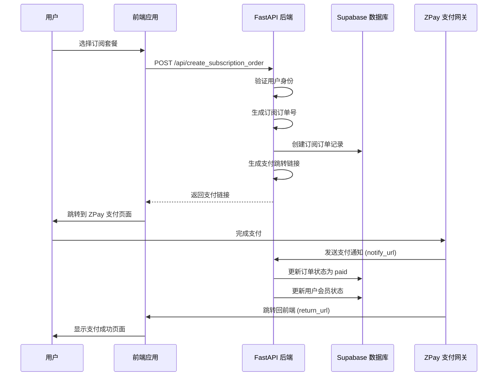
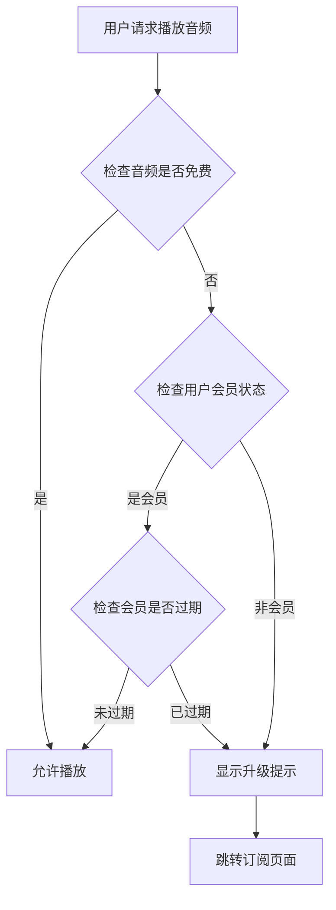

# 🎵 HERHZZZ 会员订阅系统完整指南

## 📋 系统概览

HERHZZZ 会员订阅系统为您的女性健康应用提供了完整的会员服务功能，包括 **3种订阅类型**、**音频访问控制** 和 **支付管理**。

### ✨ **核心功能**

- 🎯 **3种订阅类型**：3个月、1年、永久会员
- 🎵 **音频访问控制**：免费用户只能听每个周期的首个音频，付费用户畅享全部
- 💳 **支付集成**：ZPay 支付，支持支付宝、微信支付
- 🔐 **权限管理**：基于 JWT 的用户认证和数据隔离
- 📊 **会员状态追踪**：实时会员状态、到期时间管理
- 🎛️ **完整 API**：创建订阅、查询状态、音频权限检查

---

## 🗄️ 1. 数据库设置

### 1.1 创建订阅系统表

```bash
# 在 Supabase SQL 编辑器中运行
cd your-project
# 先运行基础订单表
-- 运行 create-orders-table.sql

# 再运行订阅系统扩展
-- 运行 create-subscription-tables.sql
```

### 1.2 数据库表结构说明

**🔹 user_memberships 表**：存储用户会员信息
```sql
- user_id: 用户ID（关联 auth.users）
- membership_type: 会员类型（free, 3_months, 1_year, lifetime）
- membership_expires_at: 会员到期时间
- is_lifetime_member: 是否永久会员
- last_subscription_order_id: 最近订阅订单ID
```

**🔹 audio_access_control 表**：音频访问控制
```sql
- audio_name: 音频文件名
- cycle_phase: 周期阶段（menstrual, follicular, ovulation, luteal）
- is_free: 是否免费音频
- display_order: 显示顺序
```

**🔹 orders 表扩展**：订阅订单支持
```sql
- order_type: 订单类型（payment, subscription）
- subscription_type: 订阅类型
- subscription_duration_days: 订阅时长
- subscription_start_date/end_date: 订阅时间范围
```

---

## ⚙️ 2. 环境配置

### 2.1 环境变量设置

```bash
# 在 backend/.env 文件中添加
SUPABASE_URL=https://your-project.supabase.co
SUPABASE_SERVICE_ROLE_KEY=your-service-role-key
SUPABASE_JWT_SECRET=your-jwt-secret

ZPAY_MERCHANT_ID=your-zpay-merchant-id
ZPAY_MERCHANT_KEY=your-zpay-merchant-key
ZPAY_NOTIFY_URL=https://your-api.com/api/payment/notify
ZPAY_RETURN_URL=https://your-app.com/subscription/success
```

### 2.2 音频文件设置

**免费音频（每个周期第一个）**：
- 🩸 **月经期**：`yaolan_chaoxi.mp3`（摇篮潮汐）
- 🌸 **卵泡期**：`yueguang_paoyu.mp3`（月光泡浴）
- 🌟 **排卵期**：`rongrong_yuesheng.mp3`（茸茸月声）
- 🌙 **黄体期**：`yekong_simiao.mp3`（梦海深潜）

**付费音频**：其他所有音频文件（共12个音频）

---

## 🚀 3. API 接口详解

### 3.1 创建订阅订单

**接口**：`POST /api/create_subscription_order`
**认证**：需要 JWT Token

```typescript
// 请求示例
const createSubscription = async (subscriptionType: '3_months' | '1_year' | 'lifetime') => {
  const response = await fetch('/api/create_subscription_order', {
    method: 'POST',
    headers: {
      'Authorization': `Bearer ${token}`,
      'Content-Type': 'application/json'
    },
    body: JSON.stringify({
      subscription_type: subscriptionType,
      payment_type: 'alipay', // 或 'wxpay'
      return_url: 'https://your-app.com/subscription/success'
    })
  });
  
  const result = await response.json();
  // 跳转到支付页面
  window.location.href = result.pay_url;
};
```

**响应示例**：
```json
{
  "out_trade_no": "20250101-143022-ABC12345",
  "pay_url": "https://zpayz.cn/submit.php?...",
  "subscription_type": "3_months",
  "subscription_name": "HERHZZZ 3个月会员",
  "amount": 29.99,
  "duration_days": 90,
  "status": "pending"
}
```

### 3.2 获取用户会员状态

**接口**：`GET /api/user/membership`

```typescript
const getMembershipStatus = async () => {
  const response = await fetch('/api/user/membership', {
    headers: {
      'Authorization': `Bearer ${token}`
    }
  });
  
  return await response.json();
};
```

**响应示例**：
```json
{
  "user_id": "user-uuid",
  "is_member": true,
  "membership_type": "3_months",
  "membership_expires_at": "2024-04-01T12:00:00Z",
  "days_remaining": 45,
  "is_lifetime_member": false
}
```

### 3.3 获取音频访问权限

**接口**：`GET /api/user/audio-access`

```typescript
const getAudioAccess = async () => {
  const response = await fetch('/api/user/audio-access', {
    headers: {
      'Authorization': `Bearer ${token}`
    }
  });
  
  return await response.json();
};
```

**响应示例**：
```json
{
  "user_membership": {
    "is_member": true,
    "membership_type": "3_months",
    "days_remaining": 45
  },
  "audio_phases": [
    {
      "cycle_phase": "menstrual",
      "phase_display_name": "月经期",
      "audios": [
        {
          "audio_name": "yaolan_chaoxi.mp3",
          "audio_display_name": "摇篮潮汐",
          "is_free": true,
          "is_accessible": true
        },
        {
          "audio_name": "fenying_wenquan.mp3",
          "audio_display_name": "温泉芬影",
          "is_free": false,
          "is_accessible": true
        }
      ],
      "free_audio_count": 1,
      "total_audio_count": 2
    }
  ],
  "total_accessible_count": 12,
  "total_audio_count": 12
}
```

### 3.4 检查特定音频访问权限

**接口**：`GET /api/audio/{audio_name}/check-access`

```typescript
const checkAudioAccess = async (audioName: string) => {
  const response = await fetch(`/api/audio/${audioName}/check-access`, {
    headers: {
      'Authorization': `Bearer ${token}`
    }
  });
  
  return await response.json();
};
```

### 3.5 获取订阅定价信息

**接口**：`GET /api/subscription/pricing`

```typescript
const getPricing = async () => {
  const response = await fetch('/api/subscription/pricing');
  return await response.json();
};
```

**响应示例**：
```json
{
  "pricing": {
    "3_months": {
      "name": "HERHZZZ 3个月会员",
      "duration_days": 90,
      "price": 29.99,
      "description": "3个月畅享全部高品质睡眠音频",
      "features": ["解锁全部周期音频", "高品质音频体验", "个性化推荐", "无广告畅听"]
    },
    "1_year": {
      "name": "HERHZZZ 1年会员",
      "duration_days": 365,
      "price": 99.99,
      "savings": "相比3个月会员节省17%"
    },
    "lifetime": {
      "name": "HERHZZZ 永久会员",
      "price": 299.99,
      "savings": "相比年费会员节省75%"
    }
  }
}
```

---

## 💻 4. 前端集成示例

### 4.1 订阅页面组件（React）

```typescript
import React, { useState, useEffect } from 'react';
import { useAuth } from '@/hooks/useAuth';

interface SubscriptionPlan {
  type: '3_months' | '1_year' | 'lifetime';
  name: string;
  price: number;
  duration_days: number | null;
  features: string[];
  savings?: string;
}

const SubscriptionPage: React.FC = () => {
  const { getAccessToken } = useAuth();
  const [plans, setPlans] = useState<SubscriptionPlan[]>([]);
  const [loading, setLoading] = useState(false);

  useEffect(() => {
    loadPricingPlans();
  }, []);

  const loadPricingPlans = async () => {
    try {
      const response = await fetch('/api/subscription/pricing');
      const data = await response.json();
      
      const planArray = Object.entries(data.pricing).map(([key, value]: [string, any]) => ({
        type: key as '3_months' | '1_year' | 'lifetime',
        ...value
      }));
      
      setPlans(planArray);
    } catch (error) {
      console.error('加载定价信息失败:', error);
    }
  };

  const handleSubscribe = async (planType: '3_months' | '1_year' | 'lifetime', paymentType: 'alipay' | 'wxpay') => {
    try {
      setLoading(true);
      const token = await getAccessToken();
      
      const response = await fetch('/api/create_subscription_order', {
        method: 'POST',
        headers: {
          'Authorization': `Bearer ${token}`,
          'Content-Type': 'application/json'
        },
        body: JSON.stringify({
          subscription_type: planType,
          payment_type: paymentType,
          return_url: `${window.location.origin}/subscription/success`
        })
      });

      if (!response.ok) {
        throw new Error('创建订阅失败');
      }

      const result = await response.json();
      
      // 跳转到支付页面
      window.location.href = result.pay_url;
      
    } catch (error) {
      console.error('订阅失败:', error);
      alert('订阅失败，请重试');
    } finally {
      setLoading(false);
    }
  };

  return (
    <div className="subscription-page">
      <h1>🎵 升级为 HERHZZZ 会员</h1>
      <p>解锁全部高品质睡眠音频，享受完整的健康体验</p>
      
      <div className="plans-grid">
        {plans.map((plan) => (
          <div key={plan.type} className="plan-card">
            <h3>{plan.name}</h3>
            <div className="price">¥{plan.price}</div>
            {plan.savings && <div className="savings">{plan.savings}</div>}
            
            <ul className="features">
              {plan.features.map((feature, index) => (
                <li key={index}>✅ {feature}</li>
              ))}
            </ul>
            
            <div className="payment-buttons">
              <button 
                onClick={() => handleSubscribe(plan.type, 'alipay')}
                disabled={loading}
                className="btn btn-alipay"
              >
                支付宝支付
              </button>
              
              <button 
                onClick={() => handleSubscribe(plan.type, 'wxpay')}
                disabled={loading}
                className="btn btn-wechat"
              >
                微信支付
              </button>
            </div>
          </div>
        ))}
      </div>
    </div>
  );
};

export default SubscriptionPage;
```

### 4.2 音频播放器组件（带权限控制）

```typescript
import React, { useState, useEffect } from 'react';
import { useAuth } from '@/hooks/useAuth';

interface AudioInfo {
  audio_name: string;
  audio_display_name: string;
  cycle_phase: string;
  is_free: boolean;
  is_accessible: boolean;
  description?: string;
}

interface AudioPlayerProps {
  cyclePhase: 'menstrual' | 'follicular' | 'ovulation' | 'luteal';
}

const AudioPlayer: React.FC<AudioPlayerProps> = ({ cyclePhase }) => {
  const { getAccessToken } = useAuth();
  const [audios, setAudios] = useState<AudioInfo[]>([]);
  const [currentAudio, setCurrentAudio] = useState<AudioInfo | null>(null);
  const [membershipStatus, setMembershipStatus] = useState<any>(null);

  useEffect(() => {
    loadAudioAccess();
  }, []);

  const loadAudioAccess = async () => {
    try {
      const token = await getAccessToken();
      const response = await fetch('/api/user/audio-access', {
        headers: {
          'Authorization': `Bearer ${token}`
        }
      });

      const data = await response.json();
      setMembershipStatus(data.user_membership);
      
      // 找到当前周期的音频
      const phaseData = data.audio_phases.find(
        (phase: any) => phase.cycle_phase === cyclePhase
      );
      
      if (phaseData) {
        setAudios(phaseData.audios);
      }
    } catch (error) {
      console.error('加载音频访问权限失败:', error);
    }
  };

  const handlePlayAudio = async (audio: AudioInfo) => {
    if (!audio.is_accessible) {
      // 显示升级提示
      showUpgradePrompt();
      return;
    }

    // 播放音频
    setCurrentAudio(audio);
    // 这里添加实际的音频播放逻辑
    const audioElement = new Audio(`/audio/${audio.audio_name}`);
    audioElement.play();
  };

  const showUpgradePrompt = () => {
    const upgrade = confirm('此音频需要会员权限才能播放。是否立即升级？');
    if (upgrade) {
      window.location.href = '/subscription';
    }
  };

  return (
    <div className="audio-player">
      <div className="membership-status">
        {membershipStatus?.is_member ? (
          <div className="member-badge">
            ✨ {membershipStatus.membership_type === 'lifetime' ? '永久会员' : `会员剩余 ${membershipStatus.days_remaining} 天`}
          </div>
        ) : (
          <div className="free-badge">
            🎵 免费用户 - <a href="/subscription">升级解锁全部音频</a>
          </div>
        )}
      </div>

      <div className="audio-list">
        {audios.map((audio) => (
          <div 
            key={audio.audio_name} 
            className={`audio-item ${!audio.is_accessible ? 'locked' : ''}`}
          >
            <div className="audio-info">
              <h4>{audio.audio_display_name}</h4>
              <p>{audio.description}</p>
              {audio.is_free && <span className="free-badge">免费</span>}
              {!audio.is_accessible && <span className="lock-icon">🔒</span>}
            </div>
            
            <button 
              onClick={() => handlePlayAudio(audio)}
              className={`play-btn ${!audio.is_accessible ? 'disabled' : ''}`}
            >
              {currentAudio?.audio_name === audio.audio_name ? '⏸️' : '▶️'}
            </button>
          </div>
        ))}
      </div>
    </div>
  );
};

export default AudioPlayer;
```

### 4.3 会员状态组件

```typescript
import React, { useState, useEffect } from 'react';
import { useAuth } from '@/hooks/useAuth';

const MembershipStatus: React.FC = () => {
  const { getAccessToken } = useAuth();
  const [membership, setMembership] = useState<any>(null);
  const [loading, setLoading] = useState(true);

  useEffect(() => {
    loadMembershipStatus();
  }, []);

  const loadMembershipStatus = async () => {
    try {
      const token = await getAccessToken();
      const response = await fetch('/api/user/membership', {
        headers: {
          'Authorization': `Bearer ${token}`
        }
      });

      const data = await response.json();
      setMembership(data);
    } catch (error) {
      console.error('加载会员状态失败:', error);
    } finally {
      setLoading(false);
    }
  };

  if (loading) {
    return <div>加载中...</div>;
  }

  return (
    <div className="membership-status">
      {membership?.is_member ? (
        <div className="member-info">
          <h3>🎉 您是 HERHZZZ 会员</h3>
          <div className="member-details">
            <p><strong>会员类型：</strong>{getMembershipTypeName(membership.membership_type)}</p>
            {membership.membership_type !== 'lifetime' && (
              <p><strong>剩余天数：</strong>{membership.days_remaining} 天</p>
            )}
            {membership.membership_expires_at && (
              <p><strong>到期时间：</strong>{new Date(membership.membership_expires_at).toLocaleDateString()}</p>
            )}
          </div>
        </div>
      ) : (
        <div className="free-user">
          <h3>🎵 免费用户</h3>
          <p>升级会员解锁全部高品质睡眠音频</p>
          <a href="/subscription" className="upgrade-btn">立即升级</a>
        </div>
      )}
    </div>
  );
};

const getMembershipTypeName = (type: string) => {
  const names = {
    '3_months': '3个月会员',
    '1_year': '1年会员',
    'lifetime': '永久会员',
    'free': '免费用户'
  };
  return names[type] || type;
};

export default MembershipStatus;
```

---

## 🔄 5. 支付流程详解

### 5.1 订阅支付完整流程



### 5.2 会员权限检查流程



---

## 🧪 6. 测试指南

### 6.1 本地测试

```bash
# 1. 启动后端服务
cd backend
python main.py

# 2. 创建测试用户并获取 JWT Token

# 3. 测试订阅接口
curl -X POST "http://localhost:8000/api/create_subscription_order" \
  -H "Authorization: Bearer your-jwt-token" \
  -H "Content-Type: application/json" \
  -d '{
    "subscription_type": "3_months",
    "payment_type": "alipay",
    "return_url": "http://localhost:3000/subscription/success"
  }'

# 4. 测试会员状态接口
curl -X GET "http://localhost:8000/api/user/membership" \
  -H "Authorization: Bearer your-jwt-token"

# 5. 测试音频访问权限
curl -X GET "http://localhost:8000/api/user/audio-access" \
  -H "Authorization: Bearer your-jwt-token"
```

### 6.2 数据库验证

```sql
-- 检查用户会员状态
SELECT * FROM check_user_membership_status('user-uuid');

-- 检查音频访问权限
SELECT check_audio_access_permission('user-uuid', 'fenying_wenquan.mp3');

-- 查看订阅订单
SELECT * FROM orders WHERE order_type = 'subscription' ORDER BY created_at DESC;

-- 查看会员信息
SELECT * FROM user_memberships ORDER BY created_at DESC;
```

---

## 🚀 7. 部署配置

### 7.1 生产环境设置

```bash
# 生产环境 .env
SUPABASE_URL=https://prod-project.supabase.co
ZPAY_MERCHANT_ID=prod_merchant_id
ZPAY_MERCHANT_KEY=prod_merchant_key
ZPAY_NOTIFY_URL=https://api.herhzzz.com/api/payment/notify
ZPAY_RETURN_URL=https://herhzzz.com/subscription/success
```

### 7.2 监控和统计

```sql
-- 会员转化率统计
SELECT 
  DATE(created_at) as date,
  COUNT(*) as total_orders,
  COUNT(CASE WHEN status = 'paid' THEN 1 END) as paid_orders,
  subscription_type,
  SUM(CASE WHEN status = 'paid' THEN amount ELSE 0 END) as revenue
FROM orders 
WHERE order_type = 'subscription'
  AND created_at >= NOW() - INTERVAL '30 days'
GROUP BY DATE(created_at), subscription_type
ORDER BY date DESC;

-- 活跃会员统计
SELECT 
  membership_type,
  COUNT(*) as member_count,
  COUNT(CASE WHEN membership_expires_at > NOW() OR is_lifetime_member THEN 1 END) as active_members
FROM user_memberships
GROUP BY membership_type;
```

---

## 🛠️ 8. 故障排除

### 8.1 常见问题

**1. "用户会员状态未更新"**
```bash
# 检查支付回调是否正常
# 查看数据库 orders 表的 status 字段
# 检查 user_memberships 表是否有记录更新
```

**2. "音频访问权限不正确"**
```bash
# 检查数据库函数 check_audio_access_permission
# 验证 audio_access_control 表数据
# 确认用户会员状态
```

**3. "订阅支付回调失败"**
```bash
# 检查 notify_url 是否可访问
# 验证支付通知签名
# 查看后端日志
```

---

## 🎉 完成！

您的 **HERHZZZ 会员订阅系统** 现在已经完全就绪！

### ✅ **功能清单**

- ✅ **订阅管理**：3种订阅类型，自动计费和到期管理
- ✅ **音频权限控制**：免费用户限制，付费用户畅享
- ✅ **支付集成**：ZPay 支付，支持支付宝、微信
- ✅ **用户体验**：完整的前端组件和状态管理
- ✅ **数据安全**：JWT 认证，RLS 权限控制
- ✅ **系统监控**：完整的数据统计和监控

### 🎯 **订阅定价**

- **3个月会员**：¥29.99（90天）
- **1年会员**：¥99.99（365天，省17%）
- **永久会员**：¥299.99（一次付费，终身畅享，省75%）

### 🎵 **音频体验**

- **免费用户**：每个周期可听1个音频（共4个免费音频）
- **付费会员**：畅享全部12个高品质睡眠音频

**您的会员订阅系统已准备为用户提供完整的健康音频体验！** 🎊 