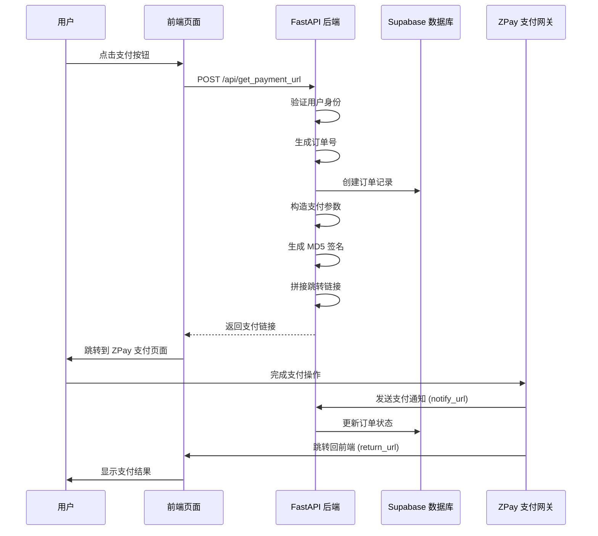

# 🔗 ZPay 页面跳转支付集成指南

## 📋 功能概览

我们为您的 HERHZZZ 项目实现了 **ZPay 页面跳转支付功能**，用户可以通过跳转到 ZPay 支付页面完成支付，支持支付宝、微信等多种支付方式。

### ✨ **核心特性**

- ✅ **页面跳转支付**：生成支付链接，用户跳转完成支付
- ✅ **多种支付方式**：支持支付宝 (alipay)、微信支付 (wxpay)
- ✅ **订单管理**：自动创建订单记录，状态跟踪
- ✅ **签名验证**：MD5 签名确保安全性
- ✅ **回调处理**：支付完成后自动更新订单状态
- ✅ **用户权限**：JWT 认证，数据隔离

---

## 🗄️ 1. 数据库准备

### 确认 Orders 表

确保已在 Supabase 中创建 `orders` 表：

```sql
-- 运行 create-orders-table.sql 文件
-- 或参考 PAYMENT_SETUP_GUIDE.md 中的数据库设置
```

---

## ⚙️ 2. 环境变量配置

在 `backend/.env` 文件中添加以下配置：

```bash
# Supabase 配置
SUPABASE_URL=https://your-project.supabase.co
SUPABASE_SERVICE_ROLE_KEY=your-service-role-key
SUPABASE_JWT_SECRET=your-jwt-secret

# ZPay 支付配置
ZPAY_MERCHANT_ID=your-zpay-merchant-id
ZPAY_MERCHANT_KEY=your-zpay-merchant-key
ZPAY_NOTIFY_URL=https://your-api-domain.com/api/payment/notify
ZPAY_RETURN_URL=https://your-frontend-domain.com/payment/success
```

### 📍 **配置说明**

- `ZPAY_NOTIFY_URL`：支付完成后 ZPay 异步通知您的后端接口
- `ZPAY_RETURN_URL`：支付完成后用户浏览器跳转的前端页面

---

## 🚀 3. API 接口详解

### 3.1 获取支付跳转链接

**接口：** `POST /api/get_payment_url`
**认证：** 需要 JWT Token

#### **请求参数**

```json
{
  "name": "HERHZZZ 高级会员",
  "amount": 29.99,
  "payment_type": "alipay",
  "user_id": "可选，不填则使用当前登录用户",
  "return_url": "可选，支付完成后的跳转页面"
}
```

#### **支付方式说明**

| 参数值 | 支付方式 | 说明 |
|--------|----------|------|
| `alipay` | 支付宝 | 支付宝扫码/网页支付 |
| `wxpay` | 微信支付 | 微信扫码/网页支付 |

#### **响应数据**

```json
{
  "out_trade_no": "20250101-143022-ABC12345",
  "pay_url": "https://zpayz.cn/submit.php?pid=xxx&type=alipay&out_trade_no=xxx&...",
  "status": "pending"
}
```

---

## 💻 4. 前端集成示例

### 4.1 React/TypeScript 实现

```typescript
import { useAuth } from '@/hooks/useAuth';

interface PaymentData {
  name: string;
  amount: number;
  payment_type: 'alipay' | 'wxpay';
  return_url?: string;
}

const createPaymentUrl = async (paymentData: PaymentData) => {
  const { getAccessToken } = useAuth();
  
  try {
    const token = await getAccessToken();
    
    const response = await fetch('http://localhost:8000/api/get_payment_url', {
      method: 'POST',
      headers: {
        'Content-Type': 'application/json',
        'Authorization': `Bearer ${token}`
      },
      body: JSON.stringify({
        ...paymentData,
        return_url: paymentData.return_url || 'https://your-site.com/payment/success'
      })
    });
    
    if (!response.ok) {
      throw new Error('获取支付链接失败');
    }
    
    const result = await response.json();
    
    // 跳转到支付页面
    window.location.href = result.pay_url;
    
    return result;
    
  } catch (error) {
    console.error('支付失败:', error);
    throw error;
  }
};

// 使用示例
const PaymentButton = () => {
  const handlePay = async (paymentType: 'alipay' | 'wxpay') => {
    try {
      await createPaymentUrl({
        name: 'HERHZZZ 高级会员',
        amount: 29.99,
        payment_type: paymentType,
        return_url: 'https://herhzzz.com/payment/success'
      });
    } catch (error) {
      alert('支付失败，请重试');
    }
  };

  return (
    <div className="payment-buttons">
      <button 
        onClick={() => handlePay('alipay')}
        className="btn btn-alipay"
      >
        支付宝支付
      </button>
      
      <button 
        onClick={() => handlePay('wxpay')}
        className="btn btn-wechat"
      >
        微信支付
      </button>
    </div>
  );
};
```

### 4.2 支付成功页面

创建一个支付成功的页面，用户支付完成后会跳转到这里：

```typescript
// pages/payment/success.tsx
import { useEffect, useState } from 'react';
import { useRouter } from 'next/router';

const PaymentSuccess = () => {
  const router = useRouter();
  const { out_trade_no } = router.query;
  const [orderStatus, setOrderStatus] = useState('checking');

  useEffect(() => {
    if (out_trade_no) {
      // 查询订单状态
      checkOrderStatus(out_trade_no as string);
    }
  }, [out_trade_no]);

  const checkOrderStatus = async (tradeNo: string) => {
    try {
      const response = await fetch(`/api/orders?search=${tradeNo}`, {
        headers: {
          'Authorization': `Bearer ${localStorage.getItem('token')}`
        }
      });
      
      const data = await response.json();
      const order = data.orders.find(o => o.out_trade_no === tradeNo);
      
      if (order) {
        setOrderStatus(order.status);
      }
    } catch (error) {
      console.error('查询订单状态失败:', error);
      setOrderStatus('error');
    }
  };

  return (
    <div className="payment-result">
      {orderStatus === 'paid' && (
        <div className="success">
          <h2>🎉 支付成功！</h2>
          <p>订单号：{out_trade_no}</p>
          <button onClick={() => router.push('/dashboard')}>
            返回首页
          </button>
        </div>
      )}
      
      {orderStatus === 'pending' && (
        <div className="pending">
          <h2>⏳ 支付处理中...</h2>
          <p>请稍等，我们正在确认您的支付</p>
          <button onClick={() => checkOrderStatus(out_trade_no as string)}>
            刷新状态
          </button>
        </div>
      )}
      
      {orderStatus === 'failed' && (
        <div className="failed">
          <h2>❌ 支付失败</h2>
          <p>支付过程中出现问题，请重试</p>
          <button onClick={() => router.push('/payment')}>
            重新支付
          </button>
        </div>
      )}
    </div>
  );
};

export default PaymentSuccess;
```

---

## 🔄 5. 支付流程详解

### 5.1 完整支付流程



### 5.2 支付参数构造

生成的支付链接示例：

```
https://zpayz.cn/submit.php?
pid=your_merchant_id&
type=alipay&
out_trade_no=20250101-143022-ABC12345&
name=HERHZZZ%20%E9%AB%98%E7%BA%A7%E4%BC%9A%E5%91%98&
money=29.99&
notify_url=https%3A//your-domain.com/api/payment/notify&
return_url=https%3A//your-frontend.com/payment/success&
param=&
sign=a1b2c3d4e5f6g7h8i9j0&
sign_type=MD5
```

---

## 🔒 6. 安全机制

### 6.1 MD5 签名验证

```python
# 签名生成步骤
params = {
    "pid": "merchant_id",
    "type": "alipay", 
    "out_trade_no": "20250101-143022-ABC12345",
    "name": "商品名称",
    "money": "29.99",
    "notify_url": "https://domain.com/notify",
    "return_url": "https://domain.com/success"
}

# 1. 按 ASCII 码排序参数
# 2. 拼接: money=29.99&name=商品名称&notify_url=...&out_trade_no=...&pid=...&return_url=...&type=alipay
# 3. 加密: md5(param_string + merchant_key)
```

### 6.2 支付通知验证

```python
# ZPay 支付完成后会向 notify_url 发送通知
@app.post("/api/payment/notify")
async def payment_notify(request: Request):
    notification_data = await request.form()
    
    # 验证签名
    if payment_service.verify_notification(dict(notification_data)):
        # 更新订单状态
        await database_service.update_order_status(
            notification_data.get("out_trade_no"), 
            "paid"
        )
        return "success"
    
    return "fail"
```

---

## 🧪 7. 测试指南

### 7.1 本地测试

```bash
# 1. 启动后端服务
cd backend
python main.py

# 2. 测试接口
curl -X POST "http://localhost:8000/api/get_payment_url" \
  -H "Authorization: Bearer your-jwt-token" \
  -H "Content-Type: application/json" \
  -d '{
    "name": "测试商品",
    "amount": 0.01,
    "payment_type": "alipay",
    "return_url": "http://localhost:3000/payment/success"
  }'
```

### 7.2 支付测试流程

1. **生成支付链接**：调用接口获取 `pay_url`
2. **跳转支付页面**：在浏览器中打开 `pay_url`
3. **完成支付**：使用测试环境完成支付
4. **验证回调**：检查订单状态是否更新为 `paid`
5. **跳转验证**：确认是否正确跳转到 `return_url`

---

## 🚀 8. 部署配置

### 8.1 生产环境配置

```bash
# 生产环境 .env
SUPABASE_URL=https://prod-project.supabase.co
ZPAY_MERCHANT_ID=prod_merchant_id
ZPAY_MERCHANT_KEY=prod_merchant_key
ZPAY_NOTIFY_URL=https://api.herhzzz.com/api/payment/notify
ZPAY_RETURN_URL=https://herhzzz.com/payment/success
DEBUG=false
```

### 8.2 域名配置注意事项

- **notify_url**：必须是可以被 ZPay 访问的公网域名
- **return_url**：用户支付完成后跳转的前端页面
- **HTTPS**：生产环境建议使用 HTTPS

---

## 🛠️ 9. 故障排除

### 常见问题

**1. "签名验证失败"**
```bash
# 检查商户密钥是否正确
echo $ZPAY_MERCHANT_KEY

# 确认参数按 ASCII 码排序
# 检查URL编码处理
```

**2. "跳转链接无效"**
```bash
# 检查生成的链接格式
# 确认 ZPay 商户配置
# 验证支付方式参数 (alipay/wxpay)
```

**3. "支付通知未收到"**
```bash
# 检查 notify_url 是否可以公网访问
# 确认防火墙/安全组配置
# 查看后端日志
```

### 调试技巧

```python
# 在生成支付链接时添加调试日志
print(f"生成的支付参数: {params}")
print(f"签名字符串: {sign_string}")
print(f"最终签名: {sign}")
print(f"支付链接: {jump_url}")
```

---

## 📊 10. 监控和优化

### 支付数据统计

```sql
-- 查询支付成功率
SELECT 
  payment_type,
  COUNT(*) as total_orders,
  COUNT(CASE WHEN status = 'paid' THEN 1 END) as paid_orders,
  ROUND(COUNT(CASE WHEN status = 'paid' THEN 1 END) * 100.0 / COUNT(*), 2) as success_rate
FROM orders 
WHERE created_at >= NOW() - INTERVAL '7 days'
GROUP BY payment_type;

-- 查询支付金额统计
SELECT 
  DATE(created_at) as payment_date,
  SUM(CASE WHEN status = 'paid' THEN amount ELSE 0 END) as total_amount,
  COUNT(CASE WHEN status = 'paid' THEN 1 END) as paid_count
FROM orders 
WHERE created_at >= NOW() - INTERVAL '30 days'
GROUP BY DATE(created_at)
ORDER BY payment_date DESC;
```

---

## 🎉 完成！

您的 **ZPay 页面跳转支付功能** 现在已经完全集成！

### ✅ **功能清单**

- ✅ 支付链接生成接口 `/api/get_payment_url`
- ✅ 支持支付宝、微信支付
- ✅ 订单自动创建和状态跟踪
- ✅ MD5 签名验证安全机制
- ✅ 支付通知自动处理
- ✅ 用户权限验证和数据隔离
- ✅ 完整的错误处理和日志记录

### 🔄 **使用流程**

1. 前端调用 `/api/get_payment_url` 生成支付链接
2. 用户跳转到 ZPay 支付页面完成支付
3. 支付完成后 ZPay 通知后端更新订单状态
4. 用户浏览器跳转回前端显示支付结果

**您的页面跳转支付系统已准备就绪！** 🎊 