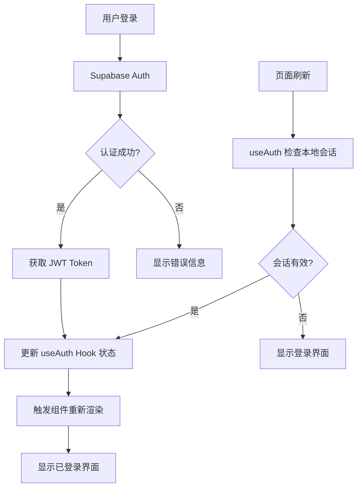
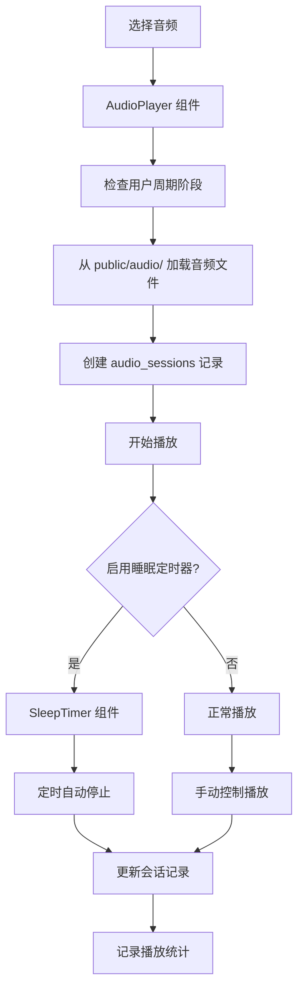

# 🏗️ HERHZZZ 项目架构文档

## 📋 项目概览

HERHZZZ 是一个专为女性周期设计的睡眠白噪音平台，采用现代化全栈架构，提供个性化的健康追踪和音频体验。

### 🛠️ 技术栈

**前端技术栈：**
- ⚛️ **React 18** - 用户界面框架
- ⚡ **Vite** - 构建工具和开发服务器
- 🎯 **TypeScript** - 类型安全的 JavaScript
- 🎨 **Tailwind CSS** - 实用优先的 CSS 框架
- 🧩 **shadcn/ui + Radix UI** - 高质量组件库
- 🛣️ **React Router** - 客户端路由
- 🔄 **TanStack Query** - 数据获取和状态管理

**后端技术栈：**
- 🐍 **FastAPI** - 高性能 Python API 框架
- 🔐 **JWT** - JSON Web Token 认证
- 🚀 **Uvicorn** - ASGI 服务器

**数据库 & 认证：**
- 🗄️ **Supabase** - PostgreSQL 数据库即服务
- 🔑 **Supabase Auth** - 身份认证服务
- 🛡️ **Row Level Security (RLS)** - 数据安全策略

---

## 📁 项目结构详解

### 🎨 前端结构 (`src/`)

```
src/
├── components/           # React 组件
│   ├── ui/              # shadcn/ui 基础组件
│   │   ├── button.tsx   # 按钮组件
│   │   ├── input.tsx    # 输入框组件
│   │   ├── dialog.tsx   # 对话框组件
│   │   └── ...          # 其他基础组件
│   ├── AuthForm.tsx     # 登录注册表单
│   ├── Dashboard.tsx    # 主仪表板
│   ├── PersonalCycle.tsx # 个人周期管理
│   ├── AudioPlayer.tsx  # 音频播放器
│   ├── SleepTimer.tsx   # 睡眠定时器
│   └── ...              # 其他业务组件
├── hooks/               # 自定义 React Hooks
│   ├── useAuth.ts       # 用户认证状态管理
│   ├── useCycle.ts      # 周期数据管理
│   └── use-toast.ts     # 提示消息管理
├── lib/                 # 工具库和配置
│   ├── supabase.ts      # Supabase 客户端配置
│   ├── database.ts      # 数据库操作封装
│   ├── api.ts           # API 请求工具（备用）
│   └── utils.ts         # 通用工具函数
├── pages/               # 页面组件
│   ├── Index.tsx        # 首页
│   └── NotFound.tsx     # 404 页面
├── App.tsx              # 应用主组件
├── main.tsx             # 应用入口点
└── index.css            # 全局样式
```

### 📦 各组件功能说明

| 组件类别 | 组件名称 | 功能描述 |
|---------|---------|---------|
| **认证组件** | `AuthForm.tsx` | 用户登录/注册表单，集成 Supabase Auth |
| **布局组件** | `ConsistentBackground.tsx` | 统一的应用背景和布局 |
| **核心功能** | `PersonalCycle.tsx` | 女性周期追踪和管理界面 |
| | `AudioPlayer.tsx` | 白噪音/音频播放功能 |
| | `SleepTimer.tsx` | 睡眠定时器，支持自动停止音频 |
| | `Dashboard.tsx` | 用户数据总览和快速操作 |
| **UI 组件** | `ui/` 目录 | 基于 shadcn/ui 的可复用基础组件 |
| **工具组件** | `DebugPanel.tsx` | 开发调试面板（仅开发环境） |

### 🐍 后端结构 (`backend/`)

```
backend/
├── main.py              # FastAPI 应用主文件
├── requirements.txt     # Python 依赖包
├── run.py              # 服务器启动脚本
└── venv/               # Python 虚拟环境
```

### 📊 数据库结构

```
Supabase PostgreSQL:
├── user_settings        # 用户设置表
│   ├── user_id (FK)    # 用户ID（关联 auth.users）
│   ├── default_cycle_length # 默认周期长度
│   ├── average_menstrual_days # 平均经期天数
│   ├── notification_enabled # 通知设置
│   └── theme_preference # 主题偏好
├── menstrual_cycles     # 月经周期记录表
│   ├── id (PK)         # 主键
│   ├── user_id (FK)    # 用户ID
│   ├── start_date      # 开始日期
│   ├── end_date        # 结束日期
│   ├── cycle_length    # 周期长度
│   ├── flow_intensity  # 经量强度
│   └── symptoms        # 症状记录
├── audio_sessions      # 音频会话记录表
│   ├── id (PK)         # 主键
│   ├── user_id (FK)    # 用户ID
│   ├── audio_name      # 音频文件名
│   ├── cycle_phase     # 周期阶段
│   ├── start_time      # 开始时间
│   ├── duration_minutes # 播放时长
│   └── completed       # 是否完成
└── sleep_records       # 睡眠记录表
    ├── id (PK)         # 主键
    ├── user_id (FK)    # 用户ID
    ├── sleep_date      # 睡眠日期
    ├── bedtime         # 就寝时间
    ├── wake_time       # 起床时间
    ├── sleep_quality_rating # 睡眠质量评分
    └── audio_used      # 使用的音频
```

---

## 🧠 数据流动 & 状态管理

### 🔄 认证数据流



### 📊 用户数据流

```mermaid
graph TD
    A[用户操作] --> B{数据类型}
    B -->|周期数据| C[useCycle Hook]
    B -->|用户设置| D[直接 Supabase 调用]
    B -->|音频会话| E[AudioPlayer 组件]
    
    C --> F[Supabase.from('menstrual_cycles')]
    D --> G[Supabase.from('user_settings')]
    E --> H[Supabase.from('audio_sessions')]
    
    F --> I[RLS 验证用户权限]
    G --> I
    H --> I
    
    I --> J{权限检查}
    J -->|通过| K[数据库操作成功]
    J -->|失败| L[返回权限错误]
    
    K --> M[更新本地状态]
    M --> N[UI 自动更新]
```

### 🎵 音频播放数据流



---

## 🔗 前后端通信方式

### 🎯 主要通信架构

**1. 前端 ↔ Supabase（主要数据通信）**
```typescript
// 直接使用 Supabase 客户端
import { supabase } from '@/lib/supabase'

// 示例：查询用户数据
const { data, error } = await supabase
  .from('menstrual_cycles')
  .select('*')
  .eq('user_id', user.id)
```

**2. 前端 ↔ FastAPI（辅助 API，可选）**
```typescript
// 使用 fetch 调用后端 API
const response = await fetch('http://localhost:8000/api/protected', {
  headers: {
    'Authorization': `Bearer ${accessToken}`,
    'Content-Type': 'application/json'
  }
})
```

### 🔐 认证机制

**JWT Token 流程：**

1. **获取 Token**（前端）
```typescript
// 从 useAuth Hook 获取访问令牌
const { getAccessToken } = useAuth()
const token = await getAccessToken()
```

2. **验证 Token**（后端）
```python
# FastAPI 依赖注入验证 JWT
def verify_jwt_token(credentials: HTTPAuthorizationCredentials = Security(security)):
    token = credentials.credentials
    payload = jwt.decode(token, SUPABASE_JWT_SECRET, algorithms=["HS256"])
    return payload
```

3. **自动刷新机制**
```typescript
// Supabase 客户端自动处理 token 刷新
const supabase = createClient(url, key, {
  auth: {
    autoRefreshToken: true,    // 自动刷新
    persistSession: true,      // 持久化会话
    detectSessionInUrl: true   // 检测 URL 中的会话
  }
})
```

---

## ☁️ Supabase 集成详解

### 🔑 身份认证流程

**1. 用户注册/登录**
```typescript
// 注册新用户
const { data, error } = await supabase.auth.signUp({
  email: 'user@example.com',
  password: 'password123'
})

// 邮箱密码登录
const { data, error } = await supabase.auth.signInWithPassword({
  email: 'user@example.com',
  password: 'password123'
})
```

**2. 会话管理**
```typescript
// 监听认证状态变化
supabase.auth.onAuthStateChange((event, session) => {
  if (event === 'SIGNED_IN') {
    // 用户登录成功
    console.log('用户已登录:', session.user)
  } else if (event === 'SIGNED_OUT') {
    // 用户登出
    console.log('用户已登出')
  }
})
```

### 🗄️ 数据库操作

**1. 查询数据（自动应用 RLS）**
```typescript
// 查询当前用户的周期数据
const { data: cycles, error } = await supabase
  .from('menstrual_cycles')
  .select(`
    id,
    start_date,
    end_date,
    cycle_length,
    symptoms
  `)
  .eq('user_id', user.id)
  .order('start_date', { ascending: false })
```

**2. 插入数据**
```typescript
// 创建新的周期记录
const { data, error } = await supabase
  .from('menstrual_cycles')
  .insert([{
    user_id: user.id,
    start_date: '2024-01-15',
    cycle_length: 28,
    flow_intensity: 'medium'
  }])
```

**3. 实时订阅**
```typescript
// 监听数据变化
const subscription = supabase
  .channel('cycle_changes')
  .on('postgres_changes', {
    event: '*',
    schema: 'public',
    table: 'menstrual_cycles',
    filter: `user_id=eq.${user.id}`
  }, (payload) => {
    console.log('数据变化:', payload)
    // 更新本地状态
  })
  .subscribe()
```

### 🛡️ 安全策略（RLS）

**Row Level Security 确保数据安全：**

```sql
-- 用户只能访问自己的数据
CREATE POLICY "Users can only see their own data" ON menstrual_cycles
  FOR ALL USING (auth.uid() = user_id);

-- 用户只能插入自己的数据
CREATE POLICY "Users can insert their own data" ON menstrual_cycles
  FOR INSERT WITH CHECK (auth.uid() = user_id);
```

### 📊 数据类型安全

```typescript
// 完整的数据库类型定义
export interface Database {
  public: {
    Tables: {
      menstrual_cycles: {
        Row: {
          id: string
          user_id: string
          start_date: string
          end_date: string | null
          cycle_length: number | null
          // ... 其他字段
        }
        Insert: {
          user_id: string
          start_date: string
          // ... 插入时需要的字段
        }
        Update: {
          start_date?: string
          end_date?: string | null
          // ... 更新时可选的字段
        }
      }
    }
  }
}
```

---

## 🚀 部署架构

### 🏗️ 生产环境结构

```
Production Environment:
├── Frontend (Vercel/Netlify)
│   ├── React App (静态文件)
│   ├── 环境变量配置
│   └── CDN 分发
├── Backend (可选，Docker/云服务器)
│   ├── FastAPI 应用
│   ├── JWT 验证服务
│   └── API 网关
└── Supabase Cloud
    ├── PostgreSQL 数据库
    ├── 认证服务
    ├── 实时订阅
    └── 存储服务
```

### 🔧 环境变量配置

**前端 (`.env`)**
```bash
VITE_SUPABASE_URL=https://your-project.supabase.co
VITE_SUPABASE_ANON_KEY=your-anon-key
```

**后端 (`.env`)**
```bash
SUPABASE_JWT_SECRET=your-jwt-secret
SUPABASE_URL=https://your-project.supabase.co
SUPABASE_SERVICE_KEY=your-service-key
```

---

## 📈 性能优化策略

### ⚡ 前端优化

- **代码分割**：使用 React.lazy() 和 Suspense
- **状态管理**：TanStack Query 缓存和自动重新获取
- **图片优化**：WebP 格式和懒加载
- **Bundle 优化**：Vite 自动 tree-shaking

### 🔄 数据库优化

- **索引优化**：在 user_id 和 date 字段上创建索引
- **查询优化**：使用 select() 只获取需要的字段
- **分页**：使用 range() 进行数据分页
- **缓存**：前端缓存查询结果

### 🛡️ 安全最佳实践

- **RLS 策略**：确保所有表都启用行级安全
- **环境变量**：敏感信息不提交到代码库
- **HTTPS**：生产环境强制使用 HTTPS
- **输入验证**：使用 Zod 进行数据验证

---

## 🎯 总结

HERHZZZ 采用现代化的全栈架构，通过 **React + Vite** 提供流畅的用户体验，**Supabase** 提供安全可靠的数据服务，**FastAPI** 提供灵活的后端扩展能力。这种架构确保了：

- ✅ **类型安全**：TypeScript 全栈类型检查
- ✅ **实时性**：Supabase 实时订阅
- ✅ **安全性**：RLS + JWT 双重保护
- ✅ **扩展性**：模块化组件设计
- ✅ **性能**：现代化构建工具和优化策略

这个架构为女性健康追踪应用提供了坚实的技术基础，支持未来的功能扩展和用户增长。 